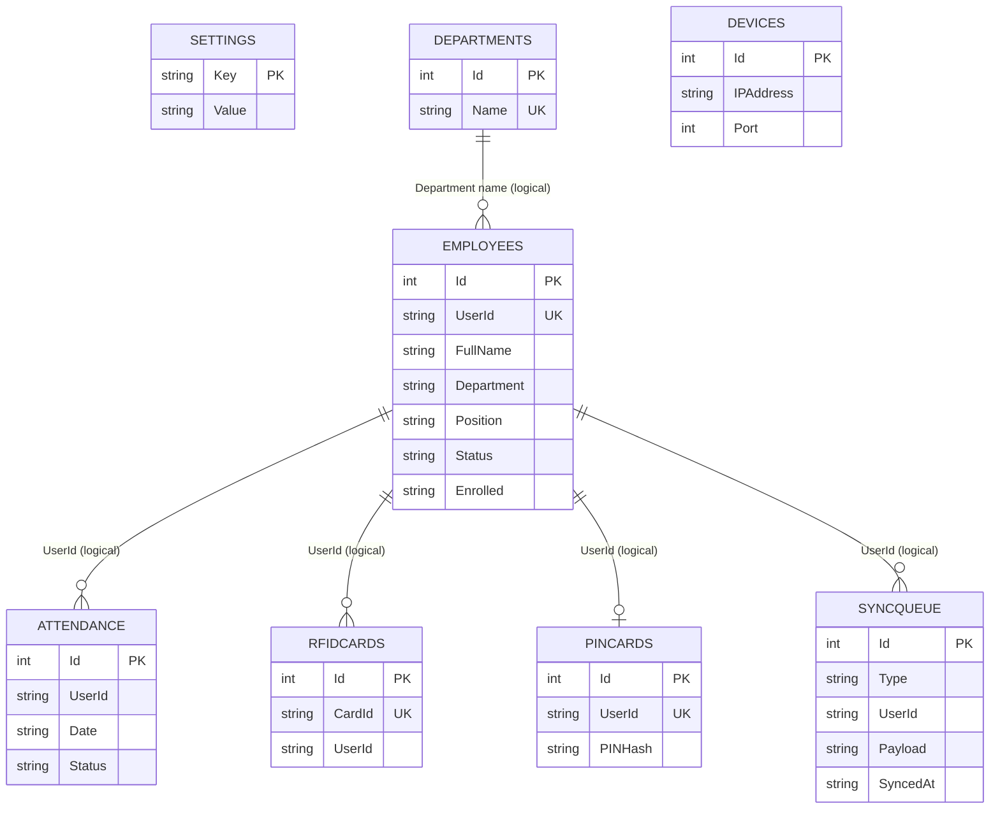

# Database schema

## Storage location and initialization

SmartAttend uses SQLite through `Microsoft.Data.Sqlite`. `DatabaseHelper` resolves the runtime database to:

```text
%LOCALAPPDATA%\SmartAttend\smartattend.db
```

`DatabaseHelper.Initialize()` creates the parent directory and opens the database on application startup. It executes `CREATE TABLE IF NOT EXISTS` statements for every table. There is no versioned migration runner, seed database, or database file tracked in the repository.

Never commit this database, copies of it, backups, WAL files, or journal files. It can contain real employee data, RFID identifiers, attendance, application settings, and PIN-related data.

## Tables

| Table | Primary key | Purpose |
| --- | --- | --- |
| `Settings` | `Key` (text) | General setup, credential hashes, recovery question/answer hash, device address, attendance rules, backup settings, and UI preferences. |
| `Departments` | `Id` | Unique department names. |
| `Employees` | `Id` | Employee profile, status, contact/email fields, enrollment flags, and creation date. `UserId` is unique. |
| `Attendance` | `Id` | Daily check-in/check-out, method, duration, status, date, and last activity. |
| `RFIDCards` | `Id` | Unique RFID card ID to employee `UserId` mapping. |
| `PINCards` | `Id` | One PIN-related value per employee `UserId`, with registration time. |
| `Devices` | `Id` | Terminal name, address, port, status, firmware version, and last-seen metadata. |
| `SyncQueue` | `Id` | Pending desktop-to-terminal updates, serialized payload, creation time, and acknowledgement time. |

### `Settings`

`Key TEXT PRIMARY KEY`, `Value TEXT NOT NULL`.

Known keys include `setup_complete`, `company_name`, `username`, `password`, `security_question`, `security_answer`, `require_login`, `work_start`, `work_end`, `grace_period`, `auth_mode`, `buzzer_enabled`, `auto_sync_enabled`, `sd_backup_enabled`, `device_ip`, `device_port`, `backup_path`, and `backup_last_run`. These are application conventions rather than schema-enforced columns.

### `Employees`

`Id INTEGER PRIMARY KEY AUTOINCREMENT`, `UserId TEXT NOT NULL UNIQUE`, `FullName`, `Department`, `Position`, optional `Contact` and `Email`, enrollment flags (`FingerprintEnrolled`, `RFIDEnrolled`, `PINEnrolled`), aggregate `Enrolled` status, `Status`, and `CreatedAt`.

Employee IDs are generated as `EMP-<number>` based on the maximum numeric suffix already stored. New profiles start active and pending enrollment. An employee is `Complete` only when all three flags are set; otherwise the aggregate status is pending or partial.

### `Attendance`

`Id INTEGER PRIMARY KEY AUTOINCREMENT`, `UserId`, `FullName`, `CheckIn`, `CheckOut`, `Method`, `Hours`, `Status`, `Date`, and `LastActivity`.

The app checks whether a row already exists for a user/date before upserting device attendance. The current schema does not define a unique constraint on `(UserId, Date)`, so this behavior is enforced in application code rather than the database.

### Authentication-related tables

`RFIDCards` stores `CardId`, `UserId`, and `RegisteredAt`; `CardId` is unique. `PINCards` stores `UserId`, `PINHash`, and `RegisteredAt`; `UserId` is unique. Despite its name, the current PIN value is Base64-encoded rather than protected by a password-hashing scheme, and the terminal requires a recoverable value for its current offline PIN flow. Treat this as a security finding, not a secure design.

### `Devices` and `SyncQueue`

`Devices` records a device name, IP/hostname, port (default `5001`), `DeviceKey` placeholder, connection status, firmware version, last seen time, and creation time. `DeviceKey` is present in the schema but is not used as API authentication.

`SyncQueue` stores a type, optional employee ID, JSON payload, creation time, and optional `SyncedAt`. Types generated by the app include `employee_upsert`, `enrollment_request`, and `employee_delete`. The queue exposes sensitive employee data to the terminal, including the currently recoverable PIN value in some employee-upsert payloads; it must remain local and uncommitted.

## Logical relationships



The diagram labels relationships as logical because the current `CREATE TABLE` statements do not declare foreign keys or additional indexes beyond primary keys and unique constraints.

## Backup and restore

The Settings page uses `BackupService` to copy the live database to a user-selected backup location. Without a saved path it chooses a OneDrive `SmartAttend Backups` folder when OneDrive exists, otherwise the Documents equivalent. It retains backups by filename date for 30 days. A fresh launch offers manual restore of a selected `.db` file; the restore routine saves the current database as a `.old` sibling before replacement.

Backups and `.old` recovery files are confidential database copies and must never be published.

